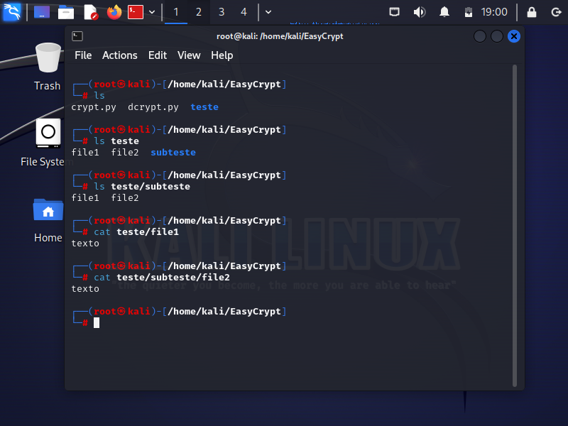

Desafio de Ransonware

Foi melhorada a ideia inicial apresentada pelo instrutor neste fork, alterando a criptografia de arquivo único para múltiplos arquivos e subpastas dentro da pasta previamente escolhida no script.
Também foi inserido o conceito de arquivo chave, gerada aleatóriamente e salva com base no nome do usuário, sendo utilizada para criptografar e descriptografar os dados.
A codificação foi relativamente rápida, tendo em visto a pouca prática em codificação porém o auxílio eficaz de uma IA generativa de texto.
A execução de teste e/ou prova de conceito pode ser visualizada nas imagens abaixo.

**O intuito desse código é apenas para estudo, não devendo ser utilizado para nenhum outro fim.**
